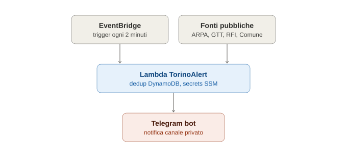

# TorinoAlert

A serverless bot that monitors public Turin-area sources (weather alerts, public transport, roadworks, air quality) and pushes real-time notifications to a Telegram channel.



## What it does

TorinoAlert polls the following public sources on a schedule:

- **ARPA Piemonte** — weather alerts (CAP XML feed)
- **GTT** — Turin public transport disruptions (metro, bus, tram)
- **RFI** — regional rail disruptions around Turin
- **Comune di Torino** — roadworks, traffic restrictions, air-quality limitations

Each new event is classified by severity (`CRIT` / `HIGH` / `MED` / `LOW` / `INFO`), deduplicated, and sent as a formatted message to a Telegram bot.

## Architecture

- **AWS Lambda** — runs the collection and notification logic (`iac/lambda/handler.py`)
- **Amazon EventBridge** — triggers the Lambda on a fixed schedule (default: every 2 minutes)
- **Amazon DynamoDB** — deduplicates events with a TTL, so the same alert isn't sent twice
- **AWS SSM Parameter Store (SecureString)** — stores the Telegram bot token and chat ID, never in code
- **Telegram Bot API** — delivers the final notification

## Prerequisites

- Terraform >= 1.5.0
- An AWS account with permissions to manage Lambda, DynamoDB, SSM, EventBridge, and IAM
- A Telegram bot token (from [@BotFather](https://t.me/BotFather)) and the target chat/channel ID

## Setup

1. Copy the example variables file and fill in your real values:
   ```bash
   cp iac/variables/variables.tfvars.example iac/variables/variables.tfvars
   ```
2. Edit `iac/variables/variables.tfvars` with your Telegram bot token and chat ID (this file is gitignored and never committed).
3. Install the Lambda dependencies before packaging:
   ```bash
   pip install -r iac/lambda/requirements.txt -t iac/lambda
   ```
4. Deploy:
   ```bash
   cd iac
   terraform init
   terraform plan -var-file="variables/variables.tfvars"
   terraform apply -var-file="variables/variables.tfvars"
   ```

## Local script

`script.py` is a standalone local runner (polling loop instead of Lambda), useful for testing without deploying. It reads credentials from environment variables:

```bash
export TORINOALERT_BOT_TOKEN="your-bot-token"
export TORINOALERT_CHAT_ID="your-chat-id"
python script.py
```

## Project structure

```
.
├── script.py                          # standalone local runner
├── iac/
│   ├── main.tf                        # Lambda, DynamoDB, SSM, EventBridge, IAM
│   ├── variables.tf                   # input variables
│   ├── outputs.tf                     # outputs
│   ├── variables/
│   │   └── variables.tfvars.example   # template for secrets, copy and fill in
│   └── lambda/
│       ├── handler.py                 # Lambda entry point
│       └── requirements.txt           # Python dependencies (installed at build time)
```

## Security notes

- Secrets are never stored in the repository — they live in SSM Parameter Store (`SecureString`) in AWS, injected into the Lambda via environment variable references.
- `variables.tfvars`, `.terraform/`, and Lambda build artifacts are gitignored — see `.gitignore`.
