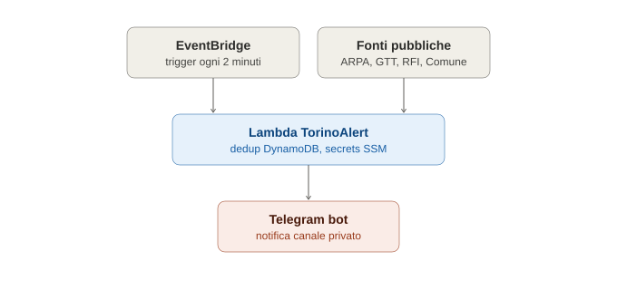

# TorinoAlert

A serverless bot that monitors public Turin-area sources (weather alerts, public transport, rail, roadworks, air quality) and pushes real-time notifications to a Telegram channel. Runs entirely inside the AWS free tier.



## What it does

Every 2 minutes TorinoAlert polls these public sources **in parallel**:

| Source | What | Notes |
|---|---|---|
| **ARPA Piemonte** | Weather alerts (CAP XML) | Only the configured zones (default `Piem-L`, Turin). Notifies when the alert level changes, including the return to green. |
| **GTT – live** | "Avvisi ultima ora" (metro, bus, tram) | |
| **GTT – news** | Service notices RSS | Promotional content filtered out. |
| **RFI** | Regional rail disruptions | RFI edits the same item over time ("sospesa" → "tornata regolare"): updates are sent as `🔄 AGGIORNAMENTO`. |
| **Comune di Torino** | Roadworks/traffic and smog limitations | Smog notices whose last date has passed are skipped. |

Each event is classified by severity (`CRIT` / `HIGH` / `MED` / `LOW` / `INFO`), deduplicated and sent to Telegram, most severe first.

### How a run works

1. **Collect** – all sources are fetched concurrently with short timeouts; a slow or broken source never blocks the others.
2. **Deduplicate** – one DynamoDB `BatchGetItem` per run. An event stays "seen" for as long as it is published, plus `dedup_ttl_days` (default 7): the TTL is refreshed while the event is still visible, so long-running notices are never re-sent.
3. **Bootstrap** – the first time a source is collected (fresh deploy, new source), its current events are recorded **silently**, so the channel is not flooded with old news.
4. **Send** – at most `max_sends_per_run` messages per run (default 10), ordered by severity. Telegram `429` responses are honoured (`retry_after`); anything not sent is retried on the next run.
5. **Health** – consecutive failures are tracked per source. After 15 failed runs (~30 min) a message goes to the optional admin chat, and another one when the source recovers.

## Cost: €0

| Service | Usage | Free tier |
|---|---|---|
| Lambda (arm64, 256 MB) | ~21,600 runs/month, a few seconds each | 1M requests + 400,000 GB-s/month, always free |
| DynamoDB (provisioned 5 RCU/5 WCU) | one batch read per run, writes only for new events | 25 RCU/25 WCU + 25 GB, always free (on-demand mode is **not** covered) |
| SSM Parameter Store (standard) | read once per Lambda container | Free |
| EventBridge scheduled rule | 1 rule | Free |
| CloudWatch Logs | one summary line per run, 7-day retention | 5 GB ingestion/month |
| CloudWatch alarms + SNS email (optional) | 2 alarms | 10 alarms, 1,000 emails/month |
| S3 (Terraform state) | a few KB | Fractions of a cent, below AWS's billing threshold |
| GitHub Actions | CI + deploy | Free for public repositories |

## Setup

Prerequisites: Terraform >= 1.10, Python 3.13, AWS CLI, an AWS account, a Telegram bot token (from [@BotFather](https://t.me/BotFather)) and the target chat/channel ID.

1. **Store the Telegram secrets in SSM** (once; they never go through Terraform or its state):
   ```bash
   aws ssm put-parameter --region eu-south-1 --type SecureString \
     --name /torino-alert/telegram/bot_token --value "<bot-token>"
   aws ssm put-parameter --region eu-south-1 --type SecureString \
     --name /torino-alert/telegram/chat_id --value "<chat-id>"
   ```
   Use `--overwrite` to rotate them.
2. **Optional settings**: copy `iac/variables/variables.tfvars.example` to `iac/variables/variables.tfvars` (gitignored) and set `admin_chat_id` / `alert_email`. If you set `alert_email`, confirm the subscription from the email AWS sends you.
3. **Build and deploy**:
   ```bash
   python scripts/build_lambda.py
   cd iac
   terraform init
   terraform apply -var-file="variables/variables.tfvars"
   ```

### Automatic deploy from GitHub (optional)

Every push to `main` runs lint and tests, then deploys with Terraform. GitHub authenticates to AWS through OIDC, so no AWS keys are stored on GitHub.

1. Create the deploy role once, locally:
   ```bash
   cd iac/bootstrap
   terraform init && terraform apply
   ```
   (Use `-var create_oidc_provider=false` if your account already has the GitHub OIDC provider.)
2. In the GitHub repository settings, add the variable `AWS_DEPLOY_ROLE_ARN` with the `deploy_role_arn` output. If you use them, also add the secrets `ADMIN_CHAT_ID` / `ALERT_EMAIL`; CI does not read your local tfvars.

Until `AWS_DEPLOY_ROLE_ARN` is set, the deploy job is skipped and only the checks run.

### Upgrading from the previous version

- The first `terraform apply` drops the old `aws_ssm_parameter` resources from the state **without deleting them** (`removed` blocks), so the Lambda keeps using the same parameters. The `telegram_*` entries in your old `variables.tfvars` are no longer needed; remove them.
- The bot token used to be stored in the Terraform state. If the state bucket was ever accessible to others, rotate the token with @BotFather and update it with `aws ssm put-parameter --overwrite`.
- Event IDs have changed, so on the first run every source bootstraps silently: there is no flood of already-sent messages.
- The DynamoDB table switches from on-demand to provisioned (AWS allows this once every 24 h).

## Local development

```bash
python -m venv .venv
.venv/Scripts/activate          # Windows; on Linux/macOS: source .venv/bin/activate
pip install -r requirements-dev.txt

ruff check .
pytest

# See what would be sent right now, without sending or saving anything:
python run_local.py --once --dry-run --no-bootstrap
```

`run_local.py` runs the same code as the Lambda, keeping its state in `local_state.json` instead of DynamoDB. To actually send messages, set `TORINOALERT_BOT_TOKEN` and `TORINOALERT_CHAT_ID` and drop `--dry-run`.

Tests use real snapshots of each source in `tests/fixtures/`. When a site changes its layout, save a new snapshot there and adjust the parser.

## Configuration

Terraform variables (`iac/variables.tf`), passed to the Lambda as environment variables:

| Variable | Default | Meaning |
|---|---|---|
| `schedule_rate_minutes` | `2` | Polling interval |
| `dedup_ttl_days` | `7` | How long an event is remembered after it disappears from its source |
| `max_sends_per_run` | `10` | Message cap per run |
| `admin_chat_id` | `""` | Telegram chat for technical alerts (source down/recovered) |
| `alert_email` | `""` | Email for CloudWatch alarms (Lambda failing or not running) |
| `arpa_zones` | `["Piem-L"]` | ARPA alert zones to monitor |

## Project structure

```
.
├── src/
│   ├── handler.py                 # Lambda entry point
│   └── torinoalert/
│       ├── runner.py              # collect → dedup → bootstrap → send → health
│       ├── sources/               # one parser per source (arpa, gtt, rfi, comune)
│       ├── store.py               # DynamoDB / file / in-memory state
│       ├── telegram.py            # Telegram client (429-aware)
│       ├── events.py              # Event model + message formatting
│       ├── text.py                # HTML cleanup, date parsing
│       └── config.py              # settings from environment
├── tests/                         # pytest + real source snapshots
├── run_local.py                   # local runner (same code, file state)
├── scripts/build_lambda.py        # builds build/lambda for Terraform
├── iac/
│   ├── main.tf                    # Lambda, DynamoDB, EventBridge, IAM, alarms
│   ├── variables.tf / outputs.tf
│   ├── variables/variables.tfvars.example
│   └── bootstrap/main.tf          # GitHub OIDC deploy role (applied once)
└── .github/
    ├── workflows/ci.yml           # lint + tests + terraform validate
    ├── workflows/deploy.yml       # tests + deploy on push to main
    └── dependabot.yml
```

## Security notes

- Telegram secrets live only in SSM Parameter Store (`SecureString`). The Lambda reads them at runtime, and they never appear in the code, Terraform variables or Terraform state.
- The Lambda role can only write to its own log group, read its two SSM parameters, and read/write its DynamoDB table.
- The GitHub deploy role can be assumed only from the `main` branch of this repository, and only on resources prefixed with the project name.
